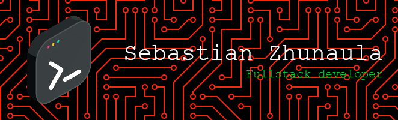

# 👋 Hello World, I'm Sebastian

<p align="center">

</p>

<p align="center">
<a href="https://www.youtube.com/@devsebastian44">
  
</a>
<a href="https://discord.com/users/1171260800908922950">
  
</a>
<a href="https://x.com/devsebastian44">
  
</a>
<a href="https://www.instagram.com/devsebastian44">
  
</a>
</p>


---

## 🚀 Sobre Mí

Soy **Desarrollador de Software Full Stack** especializado en crear soluciones web escalables y seguras. Con experiencia en **programación**, **ciberseguridad** y actualmente profundizando en **Ciencia de Datos e IA**.

```javascript
const sebastian = {
    code: ["JavaScript", "Python", "PHP", "TypeScript", "Go"],
    technologies: {
        frontend: ["React", "Angular", "Tailwind", "Bootstrap"],
        backend: ["Node.js", "Laravel", "Express"],
        databases: ["PostgreSQL", "MySQL", "MongoDB", "Redis"],
        devOps: ["Docker", "AWS", "Jenkins", "Linux"],
        security: ["Pentesting", "Malware Analysis", "Web Security"],
        dataScience: ["Pandas", "Matplotlib", "Seaborn"]
    },
    currentFocus: "Data Science & AI",
    learning: ["Neural Networks", "Ethical Hacking", "Machine Learning"],
    portfolio: "https://devsebastian44.vercel.app/",
    blog: "https://devsebastian44-blog.netlify.app/",
};
```

### 🎯 Enfoque Actual

- 💼 Estudiante en **Oracle Next Education**
- 🌱 Aprendiendo **Ciencia de Datos** e **Inteligencia Artificial**
- 🔭 Explorando **Redes Neuronales** y **Machine Learning**
- 🛡️ Profundizando en **Ciberseguridad** y **Hacking Ético**
- 🔍 Prácticas de **Pentesting** & **Análisis de Vulnerabilidades**
- 🕵️ Investigación de **Malware** y **Seguridad en Aplicaciones Web**

---

## 🛠️ Tech Stack

[](https://skillicons.dev)

---

<!--

## 📊 GitHub Stats

<div align="center">
  
  
</div>

<div align="center">
  
</div>

---

-->


<!--

## 🎯 Proyectos Destacados

### 🌟 [Nextcloud](link-al-repo)
Breve descripción del proyecto y su impacto.
- **Tech Stack:** React, Node.js, PostgreSQL

### 🌟 [Nombre del Proyecto 2](link-al-repo)
Breve descripción del proyecto y su impacto.
- **Tech Stack:** Laravel, MySQL, Bootstrap

### 🌟 [Nombre del Proyecto 3](link-al-repo)
Breve descripción del proyecto y su impacto.
- **Tech Stack:** Python, TensorFlow, Docker

---

-->

## 📫 Conectemos

¿Interesado en colaborar o tienes algún proyecto en mente? ¡No dudes en contactarme!

- 🌐 <strong>Portfolio:</strong> <a href="https://devsebastian44.vercel.app/">devsebastian44.vercel.app</a>
- 💼 <strong>LinkedIn:</strong> <a href="https://www.linkedin.com/in/devsebastian44/">devsebastian44</a>
- 📝 <strong>Blog:</strong> <a href="https://devsebastian44-blog.netlify.app/">devsebastian44-blog.netlify.app</a>

