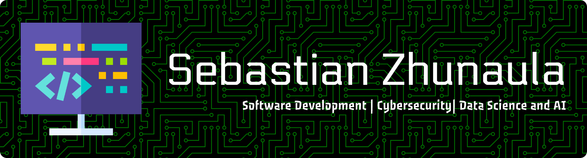
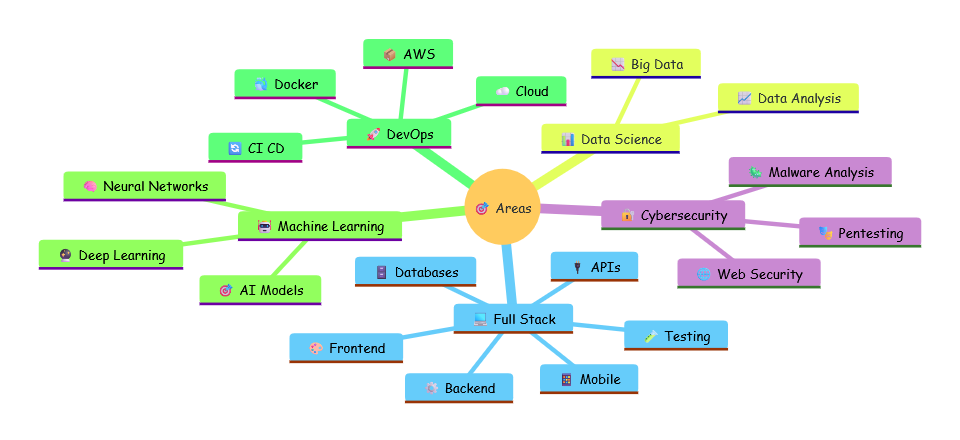

# 👋 Hello World, I'm Sebastian

<p align="center">

</p>


<div align="center">
  <a style="margin-left: 10px;" target="_blank" href="https://www.youtube.com/@devsebastian44"></a>
  <a style="margin-left: 10px;" target="_blank" href="https://www.linkedin.com/in/devsebastian44/"></a>
  <a style="margin-left: 10px;" target="_blank" href="https://discord.com/users/1171260800908922950"></a>
  <a style="margin-left: 10px;" target="_blank" href="https://x.com/devsebastian44"></a>
  <a style="margin-left: 10px;" target="_blank" href="https://www.tiktok.com/@devsebastian44"></a>
  <a style="margin-left: 10px;" target="_blank" href="https://www.instagram.com/devsebastian44"></a>
  <a style="margin-left: 10px;" target="_blank" href="https://www.threads.net/@devsebastian44"></a>
  <a style="margin-left: 10px;" target="_blank" href="https://astro.build/themes/author/2728"></a>
  <a style="margin-left: 10px;" target="_blank" href="https://codepen.io/Devsebastian44"></a>
</div>


---

## 🚀 About Me

I am a **Full Stack Software Developer** specializing in creating scalable and secure web solutions. I have experience in **programming**, **cybersecurity**, and am currently delving deeper into **Data Science and AI**.

```javascript
const sebastian = {
    role: "Full Stack Software Developer",
    location: "Ecuador 🇪🇨",
    education: "Oracle Next Education",
    
    code: ["JavaScript", "TypeScript", "Python", "PHP", "Go", "C#", "Kotlin", "Elixir"],
    
    technologies: {
        frontend: ["React", "Next.js", "Angular", "Astro", "Tailwind CSS", "Bootstrap"],
        backend: ["Node.js", "Express", "Laravel", "FastAPI"],
        databases: ["PostgreSQL", "MySQL", "MongoDB", "Redis", "Supabase", "Firebase"],
        devOps: ["Docker", "AWS", "Jenkins", "Git", "GitLab", "Linux"],
        security: ["Pentesting", "Malware Analysis", "Web Security", "Kali Linux"],
        dataScience: ["Pandas", "Matplotlib", "Seaborn", "Neural Networks"]
    },
    
    currentFocus: ["Data Science & AI", "Cybersecurity", "Machine Learning"],
    portfolio: "https://devsebastian44.vercel.app/"
};
```

## 🎯 What I'm Up To

### 💻 Programming & Development
- 🌱 Building scalable web applications
- 🚀 Exploring modern frameworks & tools
- 🎨 Creating beautiful user interfaces
- ⚡ Optimizing performance & architecture


### 🔒 Cybersecurity
- 🛡️ Ethical Hacking & Pentesting
- 🔍 Vulnerability Analysis
- 🕵️ Malware Research
- 🔐 Web Application Security


### 🧠 Data Science & AI
- 📊 Learning Data Analysis & Visualization
- 🤖 Exploring Machine Learning Algorithms
- 🧬 Studying Neural Networks & Deep Learning
- 📈 Working with Pandas, Matplotlib, and Seaborn

---

## 🗺️ Expertise Map

<p align="center">

</p>

---

## 🛠️ Tech Stack

[](https://skillicons.dev)


<!--
---

<!--

## 🚀 Featured Projects

[](https://github.com/Devsebastian44/FakeAP)
[](https://github.com/Devsebastian44/Sandboxed)

-->

---


## 📫 Let's Connect

Interested in collaborating or have a project in mind? Let's build something amazing together!

[](https://devsebastian44.vercel.app/)
[](https://www.linkedin.com/in/devsebastian44/)
